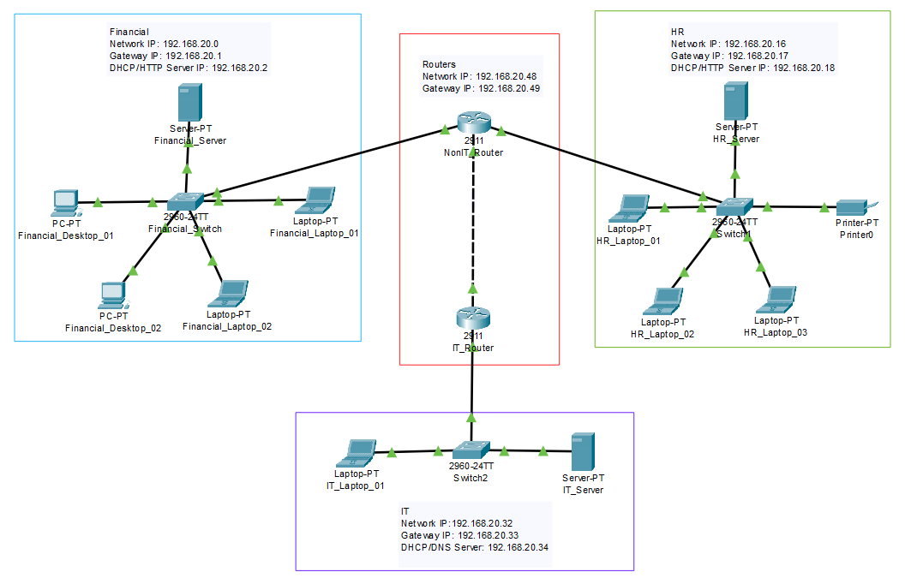

# Módulo 03 - Redes - Bootcamp DevOps Vem Ser Tech - Ada Tech

### Conexão com servidores DHCP, DNS e HTTP

### Configurações de Rede (IPs estáticos, atribuição via DHCP, Gateway e Broadcast)

### Conexão entre redes (Uso de roteadores e configurações de Gateway)

### Conexão entre roteadores e entre sub-redes (Máscaras de rede e configurações de portas Gigabit) e cálculos de sub-rede

### Projeto Final: Conexão entre 4 sub-redes com roteadores (Tabelas de roteamento)

